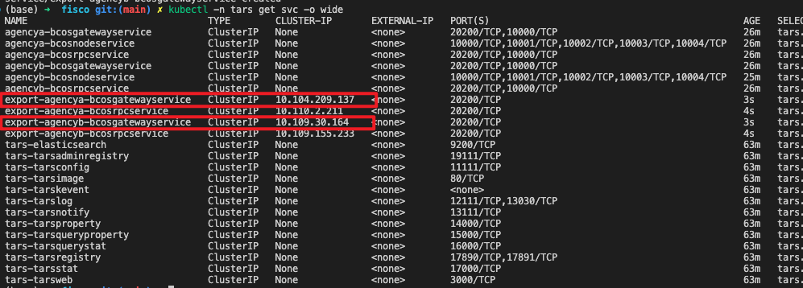
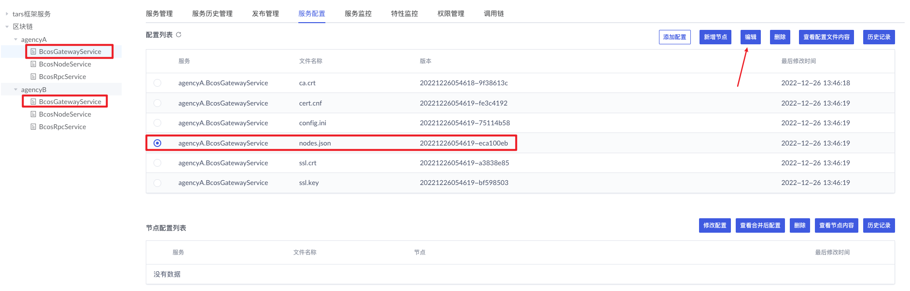
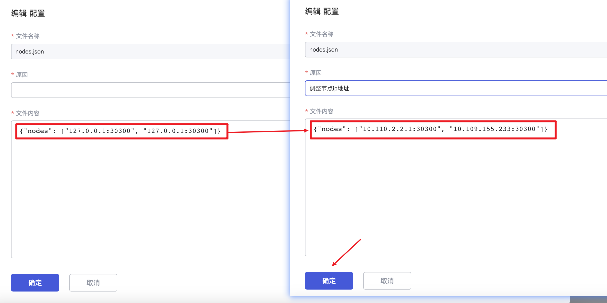
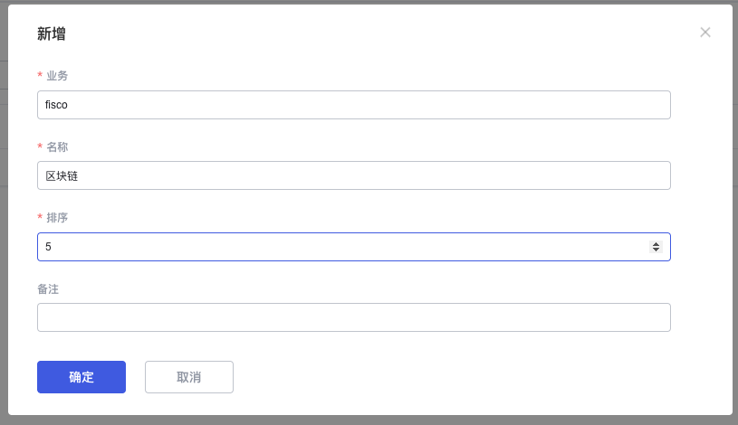
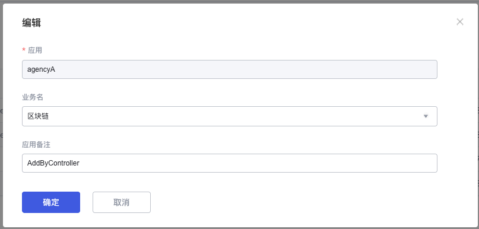
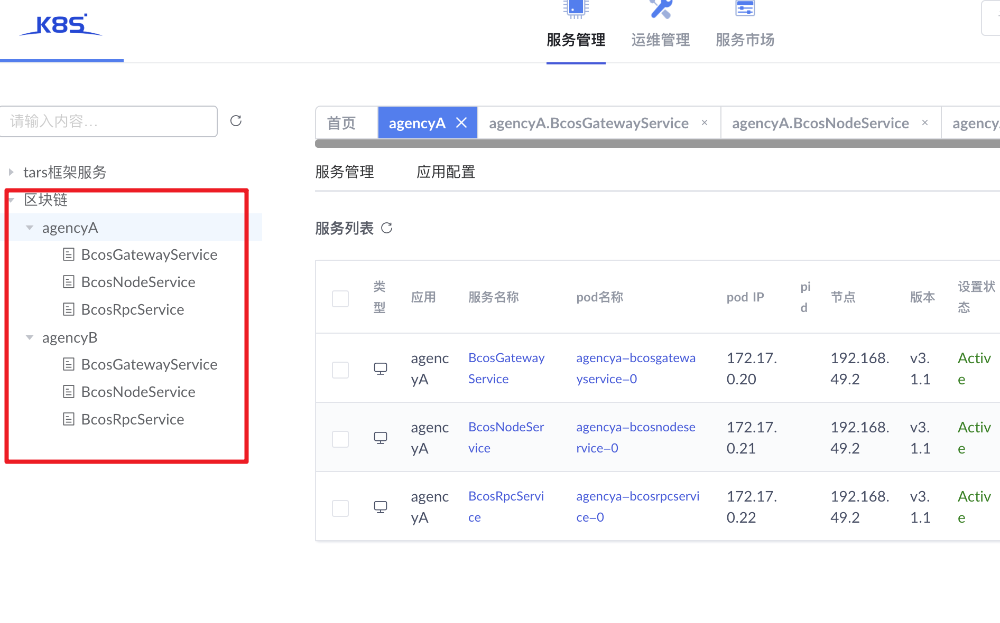
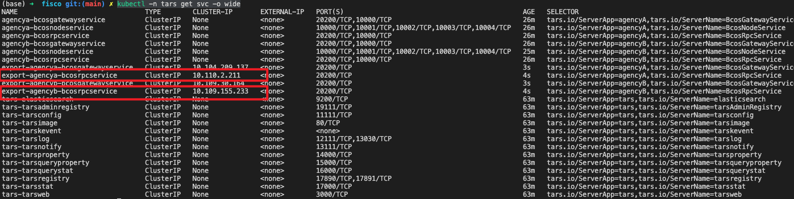

# FISCO-BCOS-ON-K8S
在k8s上部署fisco-bcos

## [创建镜像](dockerfile)

## 在k8s上安装tars，参考：https://doc.tarsyun.com/#/k8s/install.md

## 在k8s上安装FISCO-BCOS(这里只提供pro版本的安装方法)

- 下载官方 BcosBuilder 工具
```shell
cd fisco
curl -#LO https://github.com/FISCO-BCOS/FISCO-BCOS/releases/download/v3.1.1/BcosBuilder.tgz && tar -xvf BcosBuilder.tgz

# 安装依赖
cd BcosBuilder
pip3 install -r requirements.txt
cd ..
```
- 拷贝并修改配置
```shell
cp BcosBuilder/pro/conf/config-deploy-example.toml pro/config.toml

# 我们只需要生成配置，`tars_token` 随意填写就可以（不填写代码，代码无法运行）
sed -i '' 's/tars_token = ""/tars_token = "xx"/g' pro/config.toml

# 在k8s中运行的Tars服务 和具体ip没有关系，我们将所有的ip改成`127.0.0.1`
sed -i '' 's/172.25.0.3/127.0.0.1/g' pro/config.toml

# 在k8s中，每个服务都是独立容器，不会导致端口冲突，我们让rpc端口统一使用`20200`，gateway端口统一使用`30300`
sed -i '' 's/30301/30300/g' pro/config.toml
sed -i '' 's/20201/20200/g' pro/config.toml

# 其他配置修改
# ...
```

- 生成配置
```shell
cd BcosBuilder/pro
python3 build_chain.py chain -o gen-config -c ../../pro/config.toml -O ../../pro/origin-config -t rpc # 生成rpc配置
python3 build_chain.py chain -o gen-config -c ../../pro/config.toml -O ../../pro/origin-config -t gateway # 生成gateway配置
python3 build_chain.py chain -o gen-config -c ../../pro/config.toml -O ../../pro/origin-config -t node # 生成node配置
```

- 将原始配置生成k8s-yaml配置
```shell
cd ../..
source ./bin/to-yaml.sh

originConfigDir="pro/origin-config"
k8sYamlDir="pro/k8s-yaml"

chainId="chain0"
groupId="group0"


rpcConfig "$originConfigDir" "$k8sYamlDir" "$chainId" "agencyA"
rpcConfig "$originConfigDir" "$k8sYamlDir" "$chainId" "agencyB"

gatewayConfig "$originConfigDir" "$k8sYamlDir" "$chainId" "agencyA"
gatewayConfig "$originConfigDir" "$k8sYamlDir" "$chainId" "agencyB"

nodeConfig "$originConfigDir" "$k8sYamlDir" "$chainId" "agencyA" "$groupId" "node0"
nodeConfig "$originConfigDir" "$k8sYamlDir" "$chainId" "agencyB" "$groupId" "node0"
```


- 将k8s-yaml中申明的对象安装到k8s中
```shell
k8sNamespace="tars" #请根据事情情况调整
k8sYamlDir="pro/k8s-yaml"

./bin/apply-tree.sh "$k8sNamespace" "$k8sYamlDir"
```

- 创建 指向gateway、rpc 的service
```shell
source ./bin/to-yaml.sh

k8sYamlDir="pro/k8s-yaml"
k8sNamespace="tars" #请根据事情情况调整

serviceYaml "$k8sYamlDir/agencyA/rpc/service.yaml" "agencyA" "BcosRpcService" "20200"
serviceYaml "$k8sYamlDir/agencyB/rpc/service.yaml" "agencyB" "BcosRpcService" "20200"
serviceYaml "$k8sYamlDir/agencyA/gateway/service.yaml" "agencyA" "BcosGatewayService" "20200"
serviceYaml "$k8sYamlDir/agencyB/gateway/service.yaml" "agencyB" "BcosGatewayService" "20200"

kubectl apply -f "$k8sYamlDir/agencyA/rpc/service.yaml" -n "$k8sNamespace" 
kubectl apply -f "$k8sYamlDir/agencyB/rpc/service.yaml" -n "$k8sNamespace" 
kubectl apply -f "$k8sYamlDir/agencyA/gateway/service.yaml" -n "$k8sNamespace" 
kubectl apply -f "$k8sYamlDir/agencyB/gateway/service.yaml" -n "$k8sNamespace" 
```

- 修改 BcosGatewayService 服务的 nodes.json 配置，使gateway相互链接
1. 获取service的ip
    ```shell
    kubectl -n tars get svc -o wide
    ```
    
2. 修改服务配置
    
    


- 将区块链应用归到同一个业务下
    
    

    

- console链接 区块链，使用 service 导出的 rpc 地址
    